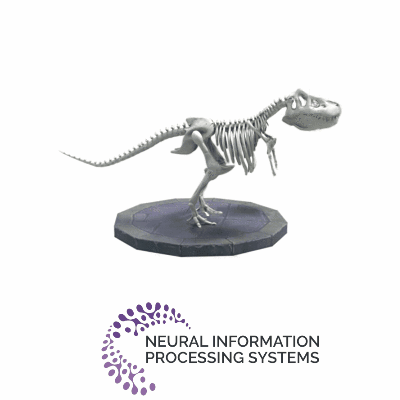

# D-MiSo
Joanna Waczynska, Piotr Borycki, Joanna Kaleta, Slawomir Tadeja, Przemysław Spurek 


This repository contains the official authors implementation associated 
with the paper "[D-MiSo: Editing Dynamic 3D Scenes using Multi-Gaussians Soup](https://arxiv.org/abs/2405.14276)".

Abstract: *
Over the past years, we have observed an abundance of approaches for modeling dynamic 3D scenes using Gaussian Splatting (GS). Such solutions use GS to represent the scene's structure and the neural network to model dynamics. Such approaches allow fast rendering and extracting each element of such a dynamic scene. However, modifying such objects over time is challenging. SC-GS (Sparse Controlled Gaussian Splatting) enhanced with Deformed Control Points partially solves this issue. However, this approach necessitates selecting elements that need to be kept fixed, as well as centroids that should be adjusted throughout editing. Moreover, this task poses additional difficulties regarding the re-productivity of such editing. To address this, we propose  **D**ynamic **M**ult**i**-Gaussian **So**up (D-MiSo), which allows us to model the mesh-inspired representation of dynamic GS. Additionally, we propose a strategy of linking parameterized Gaussian splats, forming a Triangle Soup with the estimated mesh. Consequently, we can separately construct new trajectories for the 3D objects composing the scene. Thus, we can make the scene's dynamic editable over time or while maintaining partial dynamics. *

Project Page under the [LINK](https://waczjoan.github.io/D-MiSo/).

Check us if you want having fun with animations:

 </br>
</br>

Multiple animations are possible:</br>
</br>


</br>

# Installation

Since, the software is based on original Gaussian Splatting repository, for details regarding requirements,
we kindly direct you to check  [3DGS](https://github.com/graphdeco-inria/gaussian-splatting). Here we present the most important information.

### Requirements

- Conda (recommended)
- CUDA-ready GPU with Compute Capability 7.0+
- CUDA toolkit 11 for PyTorch extensions (we used 11.8)

## Clone the Repository with submodules

```shell
# SSH
git clone git@github.com:waczjoan/D-MiSo.git --recursive
```
or
```shell
# HTTPS
git clone https://github.com/waczjoan/D-MiSo.git --recursive
```

### Environment
#### Local Setup

To install the required Python packages we used 3.7 and 3.8 python and conda v. 24.1.0
```shell
conda env create --file environment.yml
conda dmiso
```

Common issues:
- Are you sure you downloaded the repository with the --recursive flag?
- Please note that this process assumes that you have CUDA SDK **11** installed, not **12**. if you encounter a problem please refer to  [3DGS](https://github.com/graphdeco-inria/gaussian-splatting) repository.

## Datasets:
Download dataset and put it in `data` directory.
  - We use the `D-NeRF Datasets`;  dataset available under the [link](https://www.dropbox.com/scl/fi/cdcmkufncwcikk1dzbgb4/data.zip?rlkey=n5m21i84v2b2xk6h7qgiu8nkg&e=2&dl=0).
  - For `NeRF-DS` we used dataset available under the [link](https://github.com/JokerYan/NeRF-DS/releases/tag/v0.1-pre-release).
  - `PanopticSports Datasets:` find scenes under the [link](http://domedb.perception.cs.cmu.edu/).

If you would like only check renders, we share two pretrained models for `jumpingjacks` from `D-NeRF Datasets`:
- with black background: [link](https://ujchmura-my.sharepoint.com/:f:/g/personal/joanna_waczynska_doctoral_uj_edu_pl/El9_Wq79kypGjr2GbKChX3ABx427GXdIv6-cMUs50XbXTQ?e=739ALn)
- with white background: [link](https://ujchmura-my.sharepoint.com/:f:/g/personal/joanna_waczynska_doctoral_uj_edu_pl/El9_Wq79kypGjr2GbKChX3ABx427GXdIv6-cMUs50XbXTQ?e=739ALn). Additionally, here we share two modified triangle-soup needed to render modification. 

## Tutorial 
In this section we describe more details, and make step by step how to train and render D-MiSo.
1. Go to [D-NeRF Datasets](https://www.dropbox.com/scl/fi/cdcmkufncwcikk1dzbgb4/data.zip?rlkey=n5m21i84v2b2xk6h7qgiu8nkg&e=2&dl=0), download `jumpingjacks` dataset and put it in to `data` directory. For example:

```
<D-MiSo>
|---data
|   |---<jumpingjacks>
|   |---<mutant>
|   |---...
|---train.py
|---metrics.py
|---...
```

2. Train model:
  ```shell
  train.py --eval -s "data/jumpingjacks" -m "output/jumpingjacks" --iterations 80000 
  --warm_up 2000  --densify_until_iter 5000   
  --num_gauss 100000 --num_splat 25 --batch_size 10 -r 2 --is_blender
  ```
Tip1: use `-w` if you want white background

In `output/jumpingjacks` you should find: 
```
<D-MiSo>
|---data
|   |---<jumpingjacks>
|   |   |---transforms_train.json
|   |   |---...
|---output
|   |---<jumpingjacks>
|   |   |---deform
|   |   |---time_net
|   |   |---point_cloud
|   |   |---xyz
|   |   |---cfg_args
|   |   |---...
|---train.py
|---metrics.py
|---...
```

3. Evaluation:

Firstly let's check renders in init position.

In this scenario let's run:
  ```shell
  render.py -m output/jumpingjacks 
  ```
Use `--skip_train`, if you would like to skip train dataset in render.

Then, let's calculate  metrics:
```shell
python metrics.py -m output/jumpingjacks 
```
In `output/jumpingjacks` you should find: 
```
<D-MiSo>
|---output
|   |---<jumpingjacks>
|   |   |---point_cloud
|   |   |---cfg_args
|   |   |---test
|   |   |   |---<ours_best>
|   |   |---results.json
|   |   |---...
|---metrics.py
|---...
```
4. Save Triangle-Soups.

Since the modifications are based on creating triangle -soups we will, need a blender `.obj`. Use the script:
 
```shell
  scripts/render_pseudomesh.py -m "output/jumpingjacks"
 ```
Note, if necessary, modify it according to your needs! 

In `output/jumpingjacks` you should find: 
```
<D-MiSo>
|---output
|   |---<jumpingjacks>
|   |   |---point_cloud
|   |   |---cfg_args
|   |   |---triangle_soups
|   |   |   |---<ours_best>
|   |   |   |   |---core_triangle_soups
|   |   |   |   |---sub_triangle_soups
|   |   |---results.json
|   |   |---...
|---metrics.py
|---...
```

5. Own  modification* (for blender users):

You can prepare your own more realistic transformation.  Open blender app; you need download it (https://www.blender.org/); Import created objects form `sub_triangle_soups` folder. Create modification and save it:  File -> Export -> Wavefront (.obj). 

NOTE: For first our code use we prepared pre-trained model for `jumpingjacks`. Download it from [link](https://ujchmura-my.sharepoint.com/:f:/g/personal/joanna_waczynska_doctoral_uj_edu_pl/El9_Wq79kypGjr2GbKChX3ABx427GXdIv6-cMUs50XbXTQ?e=739ALn). And save it:
```
<D-MiSo>
|---output
|   |---<jumpingjacks_pre_trained_white_bg>
|   |---<jumpingjacks_pre_trained_black_bg>
|---metrics.py
|---...
```

Please download also `transforms_renders.json` from [link](https://ujchmura-my.sharepoint.com/:f:/g/personal/joanna_waczynska_doctoral_uj_edu_pl/El9_Wq79kypGjr2GbKChX3ABx427GXdIv6-cMUs50XbXTQ?e=739ALn), and put it in `data\dataset`:
for examples:
```
<D-MiSo>
|---data
|   |---<jumpingjacks>
|   |   |---transforms_renders.json
|   |   |---transforms_train.json
|   |   |---...
|   |---<mutant>
|   |---...
|---train.py
|---metrics.py
|---...
```

We prepared modification for `jumpingjacks_pre_trained_white_bg`, please find it here:
```
<D-MiSo>
|---output
|   |---<jumpingjacks_pre_trained_white_bg>
|   |   |---traingle_soups
|   |   |   |---selected
|   |   |   |   |---sub_triangle_soup_example_time_0.2300.obj
|   |   |   |   |---sub_triangle_soup_modification_1.obj
|   |   |   |   |---sub_triangle_soup_modification_2.obj
|---metrics.py
|---...
```

* `sub_triangle_soup_example_time_0.2300.obj` was selected obj created  `using scripts/render_pseudomesh.py`

6. Render modification:

To create renders based on created `obj` run:

```shell
  scripts/render_based_on_obj.py -m "output/jumpingjacks_pre_trained_white_bg" 
  --objpath "output/jumpingjacks_pre_trained_white_bg/triangle_soups/selected/sub_triangle_soup_modification_1.obj"
```

Please check also `sub_triangle_soup_modification_2.obj`.

- `sub_triangle_soup_modification_1` -- head rotation
- `sub_triangle_soup_modification_2` -- hand and leg moving

NOTE! Script `scripts/render_based_on_obj.py` uses `transforms_renders.obj` to define views. Please check it, according to your needs.

In `output/jumpingjacks` you should find `additional_views` with new renders: 
```
<D-MiSo>
|---output
|   |---<jumpingjacks>
|   |   |---point_cloud
|   |   |---cfg_args
|   |   |---additional_views
|   |   |---results.json
|   |   |---...
|---metrics.py
|---...
```


<section class="section" id="BibTeX">
  <div class="container is-max-desktop content">
    <h2 class="title">BibTeX</h2>
If you find our work useful, please consider citing:
<h3 class="title">D-MiSo: Editing Dynamic 3D Scenes using Multi-Gaussians Soup</h3>
    <pre><code>@Article{waczyńska2024dmiso,
      author         = {Joanna Waczyńska and Piotr Borycki and Joanna Kaleta and Sławomir Tadeja and Przemysław Spurek},
      title          = {D-MiSo: Editing Dynamic 3D Scenes using Multi-Gaussians Soup}, 
      year           = {2024},
      eprint         = {2405.14276},
      archivePrefix  = {arXiv},
      primaryClass   = {cs.CV}
}
</code></pre>
    <h3 class="title">Gaussian Splatting</h3>
    <pre><code>@Article{kerbl3Dgaussians,
      author         = {Kerbl, Bernhard and Kopanas, Georgios and Leimk{\"u}hler, Thomas and Drettakis, George},
      title          = {3D Gaussian Splatting for Real-Time Radiance Field Rendering},
      journal        = {ACM Transactions on Graphics},
      number         = {4},
      volume         = {42},
      month          = {July},
      year           = {2023},
      url            = {https://repo-sam.inria.fr/fungraph/3d-gaussian-splatting/}
}</code></pre>

<h3 class="title">SC-GS: Sparse-Controlled Gaussian Splatting</h3>
    <pre><code>@Article{huang2023sc,
      author         = {Huang, Yi-Hua and Sun, Yang-Tian and Yang, Ziyi and Lyu, Xiaoyang and Cao, Yan-Pei and Qi, Xiaojuan},
      title          = {SC-GS: Sparse-Controlled Gaussian Splatting for Editable Dynamic Scenes},
      journal        = {arXiv preprint arXiv:2312.14937},
      year           = {2023}
}</code></pre>
</div>

</section>